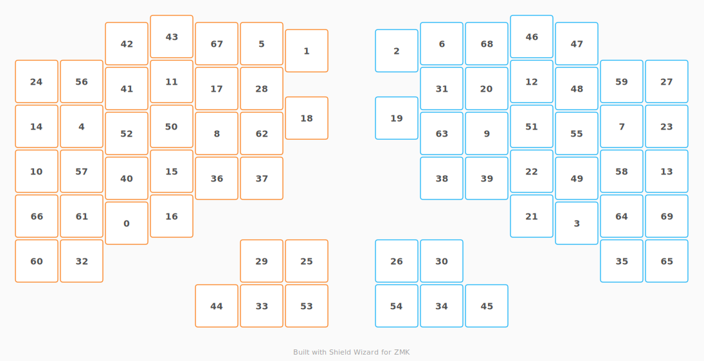

# ZMK Configuration for b0b-clavert

*Generated by Shield Wizard for ZMK*



Download compiled firmware from the Actions tab. <https://zmk.dev/docs/user-setup#installing-the-firmware>

Edit your keymap <https://zmk.dev/docs/keymaps>.
User keymap is located at [`config/b0b_clavert.keymap`](config/b0b_clavert.keymap).

-----

<details>
<summary>
Shield Wizard Debug Information
</summary>

In case of broken configuration, here is the Shield Wizard internal data used to generate this configuration:

Commit: 7ee29dba13bb6e3b8a7524c1aa57934684b06785

```json
{"name":"b0b-clavert","shield":"b0b_clavert","dongle":false,"modules":[],"layout":[{"id":"01KXRV5GNNWFSQ0CXDHBN5GARW","part":0,"row":0,"col":0,"w":1,"h":1,"x":2,"y":4.158,"r":0,"rx":0,"ry":0},{"id":"01KXRV5GNPYQA7R0X7BD2PB357","part":0,"row":0,"col":1,"w":1,"h":1,"x":6,"y":0.316,"r":0,"rx":0,"ry":0},{"id":"01KXRV5GNPKDVHB8EJKQN890QD","part":1,"row":0,"col":9,"w":1,"h":1,"x":8,"y":0.316,"r":0,"rx":0,"ry":0},{"id":"01KXRV5GNP2YBXHVZSNRBN4R1W","part":1,"row":0,"col":10,"w":1,"h":1,"x":12,"y":4.158,"r":0,"rx":0,"ry":0},{"id":"01KXRV5GNP9WB0J0HQQ2EQ192K","part":0,"row":1,"col":0,"w":1,"h":1,"x":1,"y":2,"r":0,"rx":0,"ry":0},{"id":"01KXRV5GNP2AM8GT2Y3FQVPMRM","part":0,"row":1,"col":1,"w":1,"h":1,"x":5,"y":0.158,"r":0,"rx":0,"ry":0},{"id":"01KXRV5GNPA061P61MW6WENJ74","part":1,"row":1,"col":9,"w":1,"h":1,"x":9,"y":0.158,"r":0,"rx":0,"ry":0},{"id":"01KXRV5GNPK81E4RTXJF3FASM1","part":1,"row":1,"col":10,"w":1,"h":1,"x":13,"y":2,"r":0,"rx":0,"ry":0},{"id":"01KXRV5GNP528AXCG13C0226D8","part":0,"row":2,"col":0,"w":1,"h":1,"x":4,"y":2.158,"r":0,"rx":0,"ry":0},{"id":"01KXRV5GNPQ7HFGADWB7K92YZA","part":1,"row":2,"col":10,"w":1,"h":1,"x":10,"y":2.158,"r":0,"rx":0,"ry":0},{"id":"01KXRV5GNP9SN6WJ4D7N890WXS","part":0,"row":3,"col":0,"w":1,"h":1,"x":0,"y":3,"r":0,"rx":0,"ry":0},{"id":"01KXRV5GNPK04ZW29KPVH3P1BY","part":0,"row":3,"col":1,"w":1,"h":1,"x":3,"y":1,"r":0,"rx":0,"ry":0},{"id":"01KXRV5GNPES09WX492Y62TD0J","part":1,"row":3,"col":9,"w":1,"h":1,"x":11,"y":1,"r":0,"rx":0,"ry":0},{"id":"01KXRV5GNP0S0VFK19QNG1CY93","part":1,"row":3,"col":10,"w":1,"h":1,"x":14,"y":3,"r":0,"rx":0,"ry":0},{"id":"01KXRV5GNP3F2YYAKV9VWF0WKP","part":0,"row":4,"col":0,"w":1,"h":1,"x":0,"y":2,"r":0,"rx":0,"ry":0},{"id":"01KXRV5GNPNFHCCAJE2PVBFYDG","part":0,"row":4,"col":1,"w":1,"h":1,"x":3,"y":3,"r":0,"rx":0,"ry":0},{"id":"01KXRV5GNPKYN37VFEWPR9GG1Z","part":0,"row":4,"col":2,"w":1,"h":1,"x":3,"y":4,"r":0,"rx":0,"ry":0},{"id":"01KXRV5GNPWTAYCE1K1BNA0JWT","part":0,"row":4,"col":3,"w":1,"h":1,"x":4,"y":1.158,"r":0,"rx":0,"ry":0},{"id":"01KXRV5GNPZ2Q22BCNCKM2T8K2","part":0,"row":4,"col":4,"w":1,"h":1,"x":6,"y":1.816,"r":0,"rx":0,"ry":0},{"id":"01KXRV5GNPMXX82417T03PY9K6","part":1,"row":4,"col":6,"w":1,"h":1,"x":8,"y":1.816,"r":0,"rx":0,"ry":0},{"id":"01KXRV5GNPD2CB1N9679XHM429","part":1,"row":4,"col":7,"w":1,"h":1,"x":10,"y":1.158,"r":0,"rx":0,"ry":0},{"id":"01KXRV5GNPVD1WWGCX1V6G513M","part":1,"row":4,"col":8,"w":1,"h":1,"x":11,"y":4,"r":0,"rx":0,"ry":0},{"id":"01KXRV5GNPVM6FAS8BRB6G8S8K","part":1,"row":4,"col":9,"w":1,"h":1,"x":11,"y":3,"r":0,"rx":0,"ry":0},{"id":"01KXRV5GNPBZK0W8AB8RTFH7ZH","part":1,"row":4,"col":10,"w":1,"h":1,"x":14,"y":2,"r":0,"rx":0,"ry":0},{"id":"01KXRV5GNPPBJEQ73V424QGSQR","part":0,"row":5,"col":0,"w":1,"h":1,"x":0,"y":1,"r":0,"rx":0,"ry":0},{"id":"01KXRV5GNPE0T0QQAEQBM7WB43","part":0,"row":5,"col":1,"w":1,"h":1,"x":6,"y":5,"r":0,"rx":0,"ry":0},{"id":"01KXRV5GNPPWYZM3BJJTQE9WDG","part":1,"row":5,"col":9,"w":1,"h":1,"x":8,"y":5,"r":0,"rx":0,"ry":0},{"id":"01KXRV5GNP6ZX6QK73YW1XBG7A","part":1,"row":5,"col":10,"w":1,"h":1,"x":14,"y":1,"r":0,"rx":0,"ry":0},{"id":"01KXRV5GNPWADQFQGD1YHRXANG","part":0,"row":6,"col":0,"w":1,"h":1,"x":5,"y":1.158,"r":0,"rx":0,"ry":0},{"id":"01KXRV5GNPA1PF32YTY6JYNVM8","part":0,"row":6,"col":1,"w":1,"h":1,"x":5,"y":5,"r":0,"rx":0,"ry":0},{"id":"01KXRV5GNPKBGDENAVSE0E32DC","part":1,"row":6,"col":9,"w":1,"h":1,"x":9,"y":5,"r":0,"rx":0,"ry":0},{"id":"01KXRV5GNP7Y9EQX33MDC35Z62","part":1,"row":6,"col":10,"w":1,"h":1,"x":9,"y":1.158,"r":0,"rx":0,"ry":0},{"id":"01KXRV5GNQX3VT4MVQ465FJZ88","part":0,"row":7,"col":0,"w":1,"h":1,"x":1,"y":5,"r":0,"rx":0,"ry":0},{"id":"01KXRV5GNQ44DJEXEHHGBEJRQX","part":0,"row":7,"col":1,"w":1,"h":1,"x":5,"y":6,"r":0,"rx":0,"ry":0},{"id":"01KXRV5GNQYR0K31QBNAAAF3B2","part":1,"row":7,"col":9,"w":1,"h":1,"x":9,"y":6,"r":0,"rx":0,"ry":0},{"id":"01KXRV5GNQC1X9MKCMMXETT18S","part":1,"row":7,"col":10,"w":1,"h":1,"x":13,"y":5,"r":0,"rx":0,"ry":0},{"id":"01KXRV5GNQ1TZVBDNVG6CVXNJP","part":0,"row":8,"col":0,"w":1,"h":1,"x":4,"y":3.158,"r":0,"rx":0,"ry":0},{"id":"01KXRV5GNQ0B52S8MZFF6K7C1M","part":0,"row":8,"col":1,"w":1,"h":1,"x":5,"y":3.158,"r":0,"rx":0,"ry":0},{"id":"01KXRV5GNQ0NA8PM8VWRHM982R","part":1,"row":8,"col":9,"w":1,"h":1,"x":9,"y":3.158,"r":0,"rx":0,"ry":0},{"id":"01KXRV5GNQF9H3M1XX6GHN801N","part":1,"row":8,"col":10,"w":1,"h":1,"x":10,"y":3.158,"r":0,"rx":0,"ry":0},{"id":"01KXRV5GNQT2BA0T4S08AVY9XE","part":0,"row":9,"col":0,"w":1,"h":1,"x":2,"y":3.158,"r":0,"rx":0,"ry":0},{"id":"01KXRV5GNQZR6J5KCM69PK2K48","part":0,"row":9,"col":1,"w":1,"h":1,"x":2,"y":1.158,"r":0,"rx":0,"ry":0},{"id":"01KXRV5GNQN9ZW7TE8QT8J3R5E","part":0,"row":9,"col":2,"w":1,"h":1,"x":2,"y":0.158,"r":0,"rx":0,"ry":0},{"id":"01KXRV5GNQPF5X4RBVCNZRCACF","part":0,"row":9,"col":3,"w":1,"h":1,"x":3,"y":0,"r":0,"rx":0,"ry":0},{"id":"01KXRV5GNQ12RTMSHSF21FARVV","part":0,"row":9,"col":4,"w":1,"h":1,"x":4,"y":6,"r":0,"rx":0,"ry":0},{"id":"01KXRV5GNQSZ1CV0RT6FX5FNQ4","part":1,"row":9,"col":6,"w":1,"h":1,"x":10,"y":6,"r":0,"rx":0,"ry":0},{"id":"01KXRV5GNQMSMZJ0B9PKYJFTGQ","part":1,"row":9,"col":7,"w":1,"h":1,"x":11,"y":0,"r":0,"rx":0,"ry":0},{"id":"01KXRV5GNQ217MBKMXDV7HNBV9","part":1,"row":9,"col":8,"w":1,"h":1,"x":12,"y":0.158,"r":0,"rx":0,"ry":0},{"id":"01KXRV5GNQ77VR5RY8YR557S1Q","part":1,"row":9,"col":9,"w":1,"h":1,"x":12,"y":1.158,"r":0,"rx":0,"ry":0},{"id":"01KXRV5GNQ43E2G9HRZ315SPE3","part":1,"row":9,"col":10,"w":1,"h":1,"x":12,"y":3.158,"r":0,"rx":0,"ry":0},{"id":"01KXRV5GNQH8MF3V192166K008","part":0,"row":10,"col":0,"w":1,"h":1,"x":3,"y":2,"r":0,"rx":0,"ry":0},{"id":"01KXRV5GNQAXHYYAJVHEWFQXPR","part":1,"row":10,"col":10,"w":1,"h":1,"x":11,"y":2,"r":0,"rx":0,"ry":0},{"id":"01KXRV5GNQ23W87F0EZF4984KD","part":0,"row":11,"col":0,"w":1,"h":1,"x":2,"y":2.158,"r":0,"rx":0,"ry":0},{"id":"01KXRV5GNQQB2YFWBWB0VNSD11","part":0,"row":11,"col":1,"w":1,"h":1,"x":6,"y":6,"r":0,"rx":0,"ry":0},{"id":"01KXRV5GNQRVVBSXG4GW1XJCGP","part":1,"row":11,"col":9,"w":1,"h":1,"x":8,"y":6,"r":0,"rx":0,"ry":0},{"id":"01KXRV5GNQV0BMA7E397Z0RZFX","part":1,"row":11,"col":10,"w":1,"h":1,"x":12,"y":2.158,"r":0,"rx":0,"ry":0},{"id":"01KXRV5GNQC7TK0V57Y9BRH6F8","part":0,"row":12,"col":0,"w":1,"h":1,"x":1,"y":1,"r":0,"rx":0,"ry":0},{"id":"01KXRV5GNQTKA4MNJZBE9PNFFE","part":0,"row":12,"col":1,"w":1,"h":1,"x":1,"y":3,"r":0,"rx":0,"ry":0},{"id":"01KXRV5GNQ3VMM8GCGV9F48JWM","part":1,"row":12,"col":9,"w":1,"h":1,"x":13,"y":3,"r":0,"rx":0,"ry":0},{"id":"01KXRV5GNQNVFGW8N9PMD6Q4QQ","part":1,"row":12,"col":10,"w":1,"h":1,"x":13,"y":1,"r":0,"rx":0,"ry":0},{"id":"01KXRV5GNQ4YG80AJWJ68PY0TX","part":0,"row":13,"col":0,"w":1,"h":1,"x":0,"y":5,"r":0,"rx":0,"ry":0},{"id":"01KXRV5GNQX54CD1JR6M5SD22K","part":0,"row":13,"col":1,"w":1,"h":1,"x":1,"y":4,"r":0,"rx":0,"ry":0},{"id":"01KXRV5GNQMYQDGTA88W7FMKYC","part":0,"row":13,"col":2,"w":1,"h":1,"x":5,"y":2.158,"r":0,"rx":0,"ry":0},{"id":"01KXRV5GNQZPXDPB5Q9EJV808X","part":1,"row":13,"col":8,"w":1,"h":1,"x":9,"y":2.158,"r":0,"rx":0,"ry":0},{"id":"01KXRV5GNQ8RE43M7XF7CQVWFH","part":1,"row":13,"col":9,"w":1,"h":1,"x":13,"y":4,"r":0,"rx":0,"ry":0},{"id":"01KXRV5GNQ9EHWY8DXE48X9A4N","part":1,"row":13,"col":10,"w":1,"h":1,"x":14,"y":5,"r":0,"rx":0,"ry":0},{"id":"01KXRV5GNQCJDFGV6VHFX052AM","part":0,"row":14,"col":0,"w":1,"h":1,"x":0,"y":4,"r":0,"rx":0,"ry":0},{"id":"01KXRV5GNQWPJA39PWARWTT5MV","part":0,"row":14,"col":1,"w":1,"h":1,"x":4,"y":0.158,"r":0,"rx":0,"ry":0},{"id":"01KXRV5GNQVWM8F9WHMB8GR9V4","part":1,"row":14,"col":9,"w":1,"h":1,"x":10,"y":0.158,"r":0,"rx":0,"ry":0},{"id":"01KXRV5GNQECGVZWQ5D6Y7EE59","part":1,"row":14,"col":10,"w":1,"h":1,"x":14,"y":4,"r":0,"rx":0,"ry":0}],"parts":[{"name":"left","controller":"nice_nano_v2","pins":{"d1":{"usage":"kscan","kscan":"01KXRV6J421BQZ5KCCT39G1H65","role":"input"},"d0":{"usage":"kscan","kscan":"01KXRV6J421BQZ5KCCT39G1H65","role":"input"},"d2":{"usage":"kscan","kscan":"01KXRV6J421BQZ5KCCT39G1H65","role":"input"},"d3":{"usage":"kscan","kscan":"01KXRV6J421BQZ5KCCT39G1H65","role":"input"},"d4":{"usage":"kscan","kscan":"01KXRV6J421BQZ5KCCT39G1H65","role":"input"},"d5":{"usage":"kscan","kscan":"01KXRV6J421BQZ5KCCT39G1H65","role":"input"},"d6":{"usage":"kscan","kscan":"01KXRV6J421BQZ5KCCT39G1H65","role":"input"},"d21":{"usage":"kscan","kscan":"01KXRV6J421BQZ5KCCT39G1H65","role":"output"},"d20":{"usage":"kscan","kscan":"01KXRV6J421BQZ5KCCT39G1H65","role":"output"},"d19":{"usage":"kscan","kscan":"01KXRV6J421BQZ5KCCT39G1H65","role":"output"},"d18":{"usage":"kscan","kscan":"01KXRV6J421BQZ5KCCT39G1H65","role":"output"},"d15":{"usage":"kscan","kscan":"01KXRV6J421BQZ5KCCT39G1H65","role":"output"}},"kscans":[{"kind":"matrix","id":"01KXRV6J421BQZ5KCCT39G1H65","diodes":true}],"keys":{"01KXRV5GNPPBJEQ73V424QGSQR":{"input":"d1","output":"d21"},"01KXRV5GNP3F2YYAKV9VWF0WKP":{"input":"d1","output":"d20"},"01KXRV5GNP9SN6WJ4D7N890WXS":{"input":"d1","output":"d19"},"01KXRV5GNQCJDFGV6VHFX052AM":{"input":"d1","output":"d18"},"01KXRV5GNQ4YG80AJWJ68PY0TX":{"input":"d1","output":"d15"},"01KXRV5GNQC7TK0V57Y9BRH6F8":{"input":"d0","output":"d21"},"01KXRV5GNP9WB0J0HQQ2EQ192K":{"input":"d0","output":"d20"},"01KXRV5GNQTKA4MNJZBE9PNFFE":{"input":"d0","output":"d19"},"01KXRV5GNQX54CD1JR6M5SD22K":{"input":"d0","output":"d18"},"01KXRV5GNQX3VT4MVQ465FJZ88":{"input":"d0","output":"d15"},"01KXRV5GNQN9ZW7TE8QT8J3R5E":{"input":"d2","output":"d21"},"01KXRV5GNQZR6J5KCM69PK2K48":{"input":"d2","output":"d20"},"01KXRV5GNQ23W87F0EZF4984KD":{"input":"d2","output":"d19"},"01KXRV5GNQT2BA0T4S08AVY9XE":{"input":"d2","output":"d18"},"01KXRV5GNNWFSQ0CXDHBN5GARW":{"input":"d2","output":"d15"},"01KXRV5GNQPF5X4RBVCNZRCACF":{"input":"d3","output":"d21"},"01KXRV5GNPK04ZW29KPVH3P1BY":{"input":"d3","output":"d20"},"01KXRV5GNQH8MF3V192166K008":{"input":"d3","output":"d19"},"01KXRV5GNPNFHCCAJE2PVBFYDG":{"input":"d3","output":"d18"},"01KXRV5GNPKYN37VFEWPR9GG1Z":{"input":"d3","output":"d15"},"01KXRV5GNQWPJA39PWARWTT5MV":{"input":"d4","output":"d21"},"01KXRV5GNPWTAYCE1K1BNA0JWT":{"input":"d4","output":"d20"},"01KXRV5GNP528AXCG13C0226D8":{"input":"d4","output":"d19"},"01KXRV5GNQ1TZVBDNVG6CVXNJP":{"input":"d4","output":"d18"},"01KXRV5GNQ12RTMSHSF21FARVV":{"input":"d4","output":"d15"},"01KXRV5GNP2AM8GT2Y3FQVPMRM":{"input":"d5","output":"d21"},"01KXRV5GNPWADQFQGD1YHRXANG":{"input":"d5","output":"d20"},"01KXRV5GNQMYQDGTA88W7FMKYC":{"input":"d5","output":"d19"},"01KXRV5GNQ0B52S8MZFF6K7C1M":{"input":"d5","output":"d18"},"01KXRV5GNQ44DJEXEHHGBEJRQX":{"input":"d5","output":"d15"},"01KXRV5GNPYQA7R0X7BD2PB357":{"input":"d6","output":"d21"},"01KXRV5GNPZ2Q22BCNCKM2T8K2":{"input":"d6","output":"d20"},"01KXRV5GNPA1PF32YTY6JYNVM8":{"input":"d6","output":"d19"},"01KXRV5GNPE0T0QQAEQBM7WB43":{"input":"d6","output":"d18"},"01KXRV5GNQQB2YFWBWB0VNSD11":{"input":"d6","output":"d15"}},"encoders":[],"buses":{}},{"name":"right","controller":"nice_nano_v2","pins":{"d21":{"usage":"kscan","kscan":"01KXRVBY22TBNMG8SYYZSFFQAX","role":"output"},"d20":{"usage":"kscan","kscan":"01KXRVBY22TBNMG8SYYZSFFQAX","role":"output"},"d19":{"usage":"kscan","kscan":"01KXRVBY22TBNMG8SYYZSFFQAX","role":"output"},"d18":{"usage":"kscan","kscan":"01KXRVBY22TBNMG8SYYZSFFQAX","role":"output"},"d15":{"usage":"kscan","kscan":"01KXRVBY22TBNMG8SYYZSFFQAX","role":"output"},"d4":{"usage":"kscan","kscan":"01KXRVBY22TBNMG8SYYZSFFQAX","role":"input"},"d5":{"usage":"kscan","kscan":"01KXRVBY22TBNMG8SYYZSFFQAX","role":"input"},"d6":{"usage":"kscan","kscan":"01KXRVBY22TBNMG8SYYZSFFQAX","role":"input"},"d7":{"usage":"kscan","kscan":"01KXRVBY22TBNMG8SYYZSFFQAX","role":"input"},"d8":{"usage":"kscan","kscan":"01KXRVBY22TBNMG8SYYZSFFQAX","role":"input"},"d9":{"usage":"kscan","kscan":"01KXRVBY22TBNMG8SYYZSFFQAX","role":"input"},"d10":{"usage":"kscan","kscan":"01KXRVBY22TBNMG8SYYZSFFQAX","role":"input"},"d0":{"usage":"bus","bus":"spi0","role":"sck"},"d1":{"usage":"bus","bus":"spi0","role":"mosi"},"d2":{"usage":"bus","bus":"spi0","role":"miso"},"d3":{"usage":"device","deviceId":"01KXS7125YH9VTZW8QSM9SGC89","role":"cs"}},"kscans":[{"kind":"matrix","id":"01KXRVBY22TBNMG8SYYZSFFQAX","diodes":true}],"keys":{"01KXRV5GNP6ZX6QK73YW1XBG7A":{"input":"d4","output":"d21"},"01KXRV5GNPBZK0W8AB8RTFH7ZH":{"input":"d4","output":"d20"},"01KXRV5GNP0S0VFK19QNG1CY93":{"input":"d4","output":"d19"},"01KXRV5GNQECGVZWQ5D6Y7EE59":{"input":"d4","output":"d18"},"01KXRV5GNQ9EHWY8DXE48X9A4N":{"input":"d4","output":"d15"},"01KXRV5GNQNVFGW8N9PMD6Q4QQ":{"input":"d5","output":"d21"},"01KXRV5GNPK81E4RTXJF3FASM1":{"input":"d5","output":"d20"},"01KXRV5GNQ3VMM8GCGV9F48JWM":{"input":"d5","output":"d19"},"01KXRV5GNQ8RE43M7XF7CQVWFH":{"input":"d5","output":"d18"},"01KXRV5GNQC1X9MKCMMXETT18S":{"input":"d5","output":"d15"},"01KXRV5GNQ217MBKMXDV7HNBV9":{"input":"d6","output":"d21"},"01KXRV5GNQ77VR5RY8YR557S1Q":{"input":"d6","output":"d20"},"01KXRV5GNQV0BMA7E397Z0RZFX":{"input":"d6","output":"d19"},"01KXRV5GNQ43E2G9HRZ315SPE3":{"input":"d6","output":"d18"},"01KXRV5GNP2YBXHVZSNRBN4R1W":{"input":"d6","output":"d15"},"01KXRV5GNQMSMZJ0B9PKYJFTGQ":{"input":"d7","output":"d21"},"01KXRV5GNPES09WX492Y62TD0J":{"input":"d7","output":"d20"},"01KXRV5GNQAXHYYAJVHEWFQXPR":{"input":"d7","output":"d19"},"01KXRV5GNPVM6FAS8BRB6G8S8K":{"input":"d7","output":"d18"},"01KXRV5GNPVD1WWGCX1V6G513M":{"input":"d7","output":"d15"},"01KXRV5GNQVWM8F9WHMB8GR9V4":{"input":"d8","output":"d21"},"01KXRV5GNPD2CB1N9679XHM429":{"input":"d8","output":"d20"},"01KXRV5GNPQ7HFGADWB7K92YZA":{"input":"d8","output":"d19"},"01KXRV5GNQF9H3M1XX6GHN801N":{"input":"d8","output":"d18"},"01KXRV5GNQSZ1CV0RT6FX5FNQ4":{"input":"d8","output":"d15"},"01KXRV5GNPA061P61MW6WENJ74":{"input":"d9","output":"d21"},"01KXRV5GNP7Y9EQX33MDC35Z62":{"input":"d9","output":"d20"},"01KXRV5GNQZPXDPB5Q9EJV808X":{"input":"d9","output":"d19"},"01KXRV5GNQ0NA8PM8VWRHM982R":{"input":"d9","output":"d18"},"01KXRV5GNQYR0K31QBNAAAF3B2":{"input":"d9","output":"d15"},"01KXRV5GNPKDVHB8EJKQN890QD":{"input":"d10","output":"d21"},"01KXRV5GNPMXX82417T03PY9K6":{"input":"d10","output":"d20"},"01KXRV5GNPKBGDENAVSE0E32DC":{"input":"d10","output":"d19"},"01KXRV5GNPPWYZM3BJJTQE9WDG":{"input":"d10","output":"d18"},"01KXRV5GNQRVVBSXG4GW1XJCGP":{"input":"d10","output":"d15"}},"encoders":[],"buses":{"spi0":{"type":"spi","devices":[{"id":"01KXS7125YH9VTZW8QSM9SGC89","type":"niceview"}]}}}]}
```

</details>
